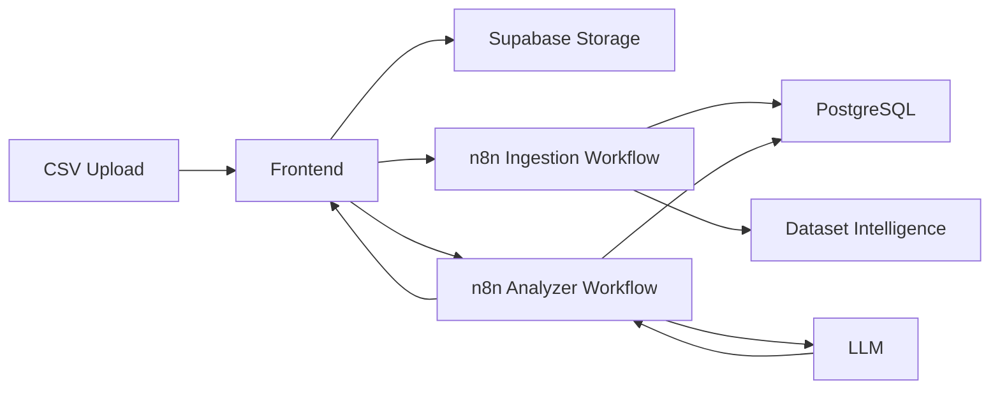

# AnalyzerOS

AnalyzerOS is an AI-powered data analysis system that turns uploaded CSV datasets into structured, queryable analytical workspaces.

It automatically:

- profiles uploaded datasets
- infers schema, grain, measures, dimensions, and time fields
- performs safe cleaning/profiling
- persists row-level data to PostgreSQL
- lets users ask natural-language analytical questions
- generates evidence-backed SQL analysis
- surfaces metrics, trends, segments, investigations, and data-quality issues

```
Frontend UI
→ n8n workflows
→ Supabase Storage
→ PostgreSQL
→ AI analysis
→ dashboard / investigations
```

## 1. Overview

Upload a CSV. AnalyzerOS stores the file, profiles it, writes cleaned rows to PostgreSQL, and opens a workspace where you can review quality, build a dashboard, and ask follow-up questions. The numbers in that workspace are meant to come from persisted rows, not from a static profile snapshot.

## 2. Why I built it

Traditional dashboards require analysts to define metrics, queries, and charts before anyone else can explore the file. That first hour is mostly mechanical: what is a row, which columns are measures, what is broken, and what is worth plotting.

AnalyzerOS automates that first layer of dataset understanding and analysis so a new CSV can become a usable workspace without a hand-built semantic model.

## 3. Features

- CSV ingestion through Supabase Storage
- Automatic dataset profiling
- Schema inference and measure / dimension discovery
- Data quality scoring and reviewable cleaning suggestions
- Row-backed PostgreSQL analysis
- Natural-language questions in the AI Analyst
- Investigation history
- Dataset-specific dashboard generation
- Safe, read-only SQL analysis scoped by `dataset_id`

## 4. Architecture



| Layer | Role |
| --- | --- |
| Frontend | Next.js / React interface |
| n8n | Workflow orchestration for ingest, analyze, and clean |
| Supabase | Storage plus PostgreSQL |
| LLM | Dataset interpretation and analysis planning |
| PostgreSQL | Source of truth for analytical calculations |

Details: [docs/architecture.md](docs/architecture.md)

## 5. Analysis architecture

Metadata is used to understand the dataset.

Actual metrics, totals, trends, segments, and comparisons should be computed from persisted dataset rows.

```
Question
→ Dataset context
→ Analysis plan
→ Safe SQL
→ PostgreSQL execution
→ Evidence
→ Plain-English answer
```

Every analytical query is filtered by the canonical `dataset_id` from ingestion. Storage folder IDs and chat session IDs are not dataset identity.

## 6. Screenshots

Add captures to [`docs/screenshots/`](docs/screenshots/) before publishing (landing, review, dashboard, analyst). This repository does not ship screenshot binaries yet.

## 7. Tech stack

From `package.json` and the live integrations:

- Next.js 14
- React 18
- TypeScript
- Tailwind CSS
- Recharts
- n8n
- Supabase (Storage + PostgreSQL)
- LLM integration inside n8n (typically OpenAI)

## 8. Repository structure

The Next.js app stays at the repository root so imports and scripts keep working.

```
AnalyzerOS/
├── src/                         # Next.js App Router frontend
├── public/
├── n8n/
│   ├── README.md
│   ├── ingestion-fix-nodes.json
│   ├── ingestion-workflow.json.example
│   ├── analyzer-workflow.json.example
│   └── cleaning-workflow.json.example
├── database/
│   ├── README.md
│   ├── schema.sql
│   └── readonly-dataset-row-queries.sql
├── docs/
│   ├── architecture.md
│   ├── setup.md
│   └── screenshots/
├── sample-data/
│   └── README.md
├── supabase/migrations/         # SQL applied during development
├── .env.example
├── .gitignore
├── LICENSE
├── package.json
└── README.md
```

## 9. Local setup

```bash
git clone <your-fork-url>
cd AnalyzerOS
npm install
cp .env.example .env.local
```

Fill the variables in `.env.local`, then:

```bash
npm run dev
```

Open [http://localhost:3000](http://localhost:3000).

Step-by-step: [docs/setup.md](docs/setup.md)

## 10. n8n setup

- Export each workflow from n8n and place the JSON under `/n8n`
- Import on a new instance and reconnect credentials
- Use production webhook URLs
- Set `N8N_INGEST_URL`, `N8N_ANALYZE_URL`, and `N8N_CLEANING_URL`

See [n8n/README.md](n8n/README.md).

## 11. Supabase setup

- Create a project and the `analyzeros-datasets` bucket
- Create the dataset tables used by your workflows
- Apply `database/readonly-dataset-row-queries.sql`
- Configure Storage and table policies
- Never expose the service-role key to the browser

See [database/README.md](database/README.md).

## 12. Security

- Analytical queries are read-only (`SELECT` / `WITH`)
- Row access is isolated by `dataset_id`
- n8n webhook URLs stay on the server
- `.env` and `.env.local` are gitignored
- Service-role keys, database passwords, and LLM keys are not committed

## 13. Current status

AnalyzerOS is an active portfolio / prototype project. It is not production-ready. Expect local environment setup, n8n credential wiring, and dataset-specific edge cases.

## 14. Future improvements

- Stronger SQL validation
- Authentication and multi-tenancy
- Larger-dataset optimization
- Asynchronous ingestion
- Cached metric computation
- Richer visualization generation
- Automated evaluation framework

## 15. Author

Portfolio project. Add your name, LinkedIn, and contact details here before you publish the repository.
