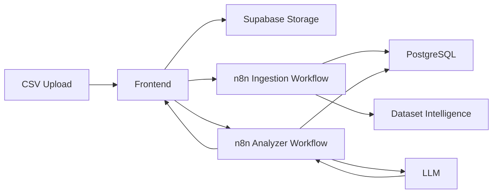

# AnalyzerOS architecture

AnalyzerOS is a CSV-to-workspace pipeline. The frontend is a Next.js app. n8n orchestrates ingestion, analysis, and cleaning. Supabase provides Storage and PostgreSQL. An LLM plans analysis; PostgreSQL computes the numbers.

`dataset_id` is the only identifier that links Storage metadata, Postgres rows, n8n workflows, and the UI.

## A. Ingestion

1. The browser uploads the CSV to the `analyzeros-datasets` Storage bucket.
2. The app POSTs storage metadata (bucket, path, filename, size, upload session) to `/api/ingest`.
3. `/api/ingest` forwards that payload to `N8N_INGEST_URL`.
4. n8n downloads the object, parses the CSV, profiles batches, and writes:
   - `dealos_datasets`
   - `dealos_dataset_rows` (`raw_data` + `clean_data`)
   - `dealos_dataset_columns`
   - `dealos_dataset_metrics`
   - profiling batches when configured
5. The webhook response must include `success: true` and `dataset.id`.
6. The frontend stores that UUID as `activeDataset.id`. It never reuses the Storage folder UUID as `dataset_id`.

## B. Analysis

1. Build Dashboard or the AI Analyst calls `/api/analyze` with the canonical `dataset_id`.
2. The server loads column metadata and verifies persisted rows for that UUID.
3. n8n (and/or read-only SQL helpers) plan the question against known fields.
4. Safe SQL runs against `public.dealos_dataset_rows.clean_data`, always filtered by `dataset_id`.
5. Evidence and a plain-English answer return to the workspace.

Flow:

Question → dataset context → analysis plan → safe SQL → PostgreSQL → evidence → plain-English answer

Metadata explains fields. Counts, sums, averages, trends, segments, and rankings come from rows.

## C. Cleaning decisions

1. Profiling can surface quality issues on the review and Data Quality views.
2. The user approves, edits, or ignores a suggestion.
3. The app POSTs the decision to `/api/cleaning` with the same `dataset_id`.
4. n8n applies or records the decision. The UI marks an item resolved only after a successful backend response.

## Why `dataset_id` is canonical

- Storage folder IDs exist only to avoid filename collisions.
- Conversation `session_id` values exist only to group chat turns.
- Dataset name and filename are labels.

If analysis uses any other identifier, SQL returns zero rows even when ingestion succeeded.
